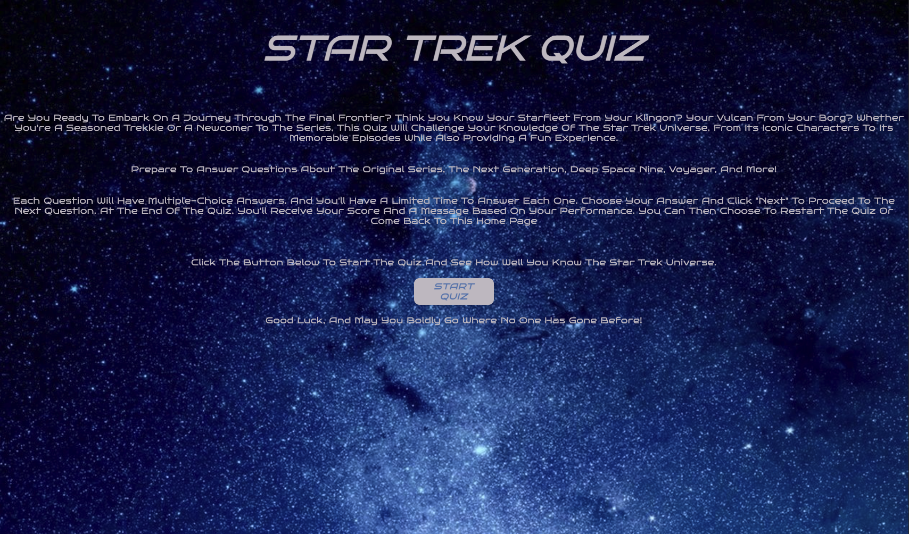
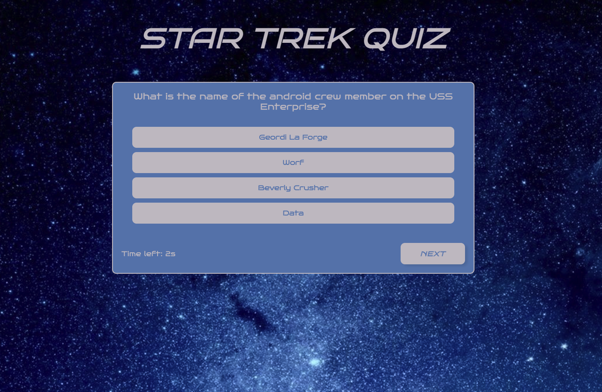
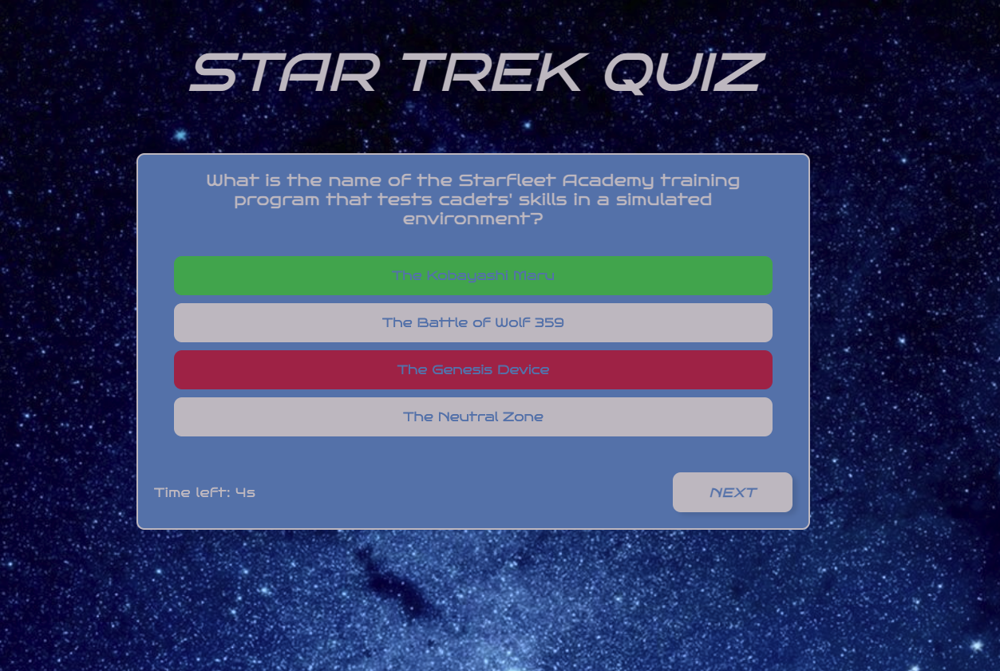
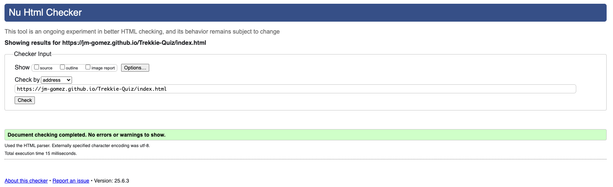
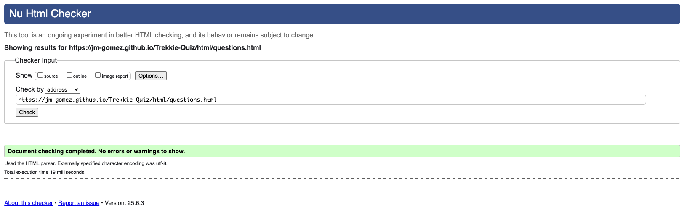
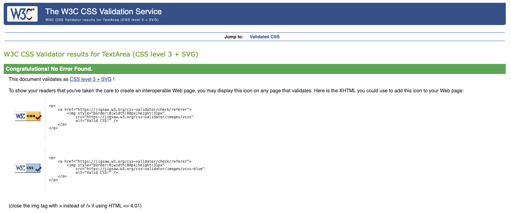
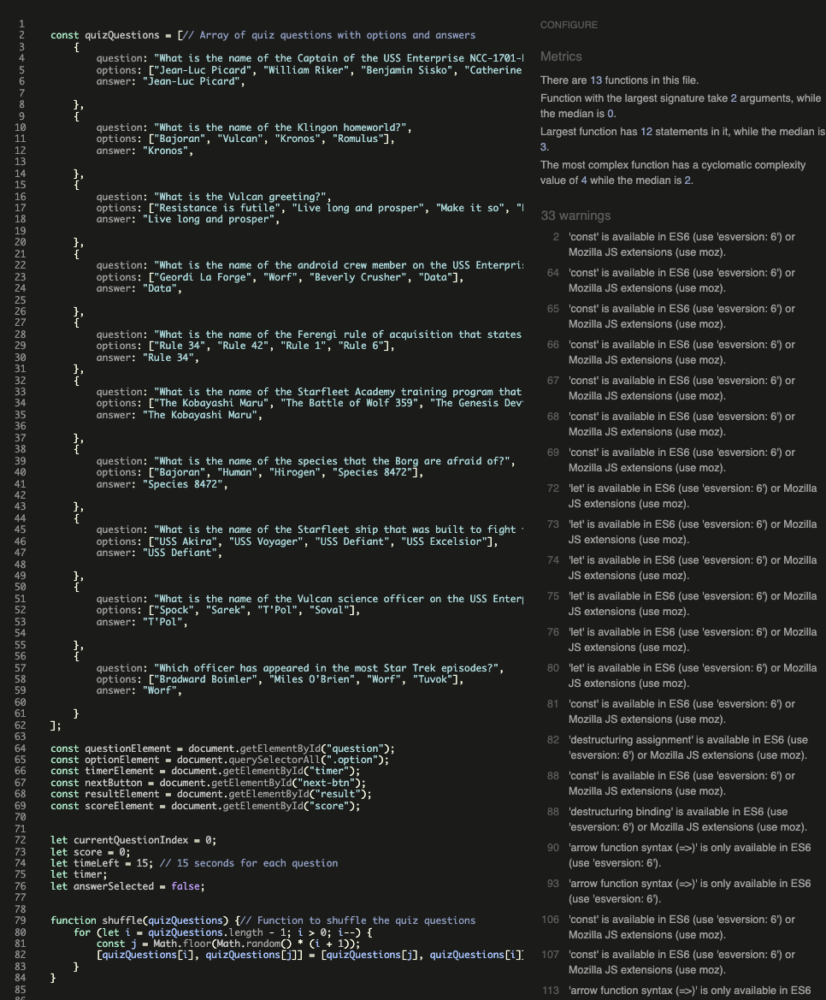
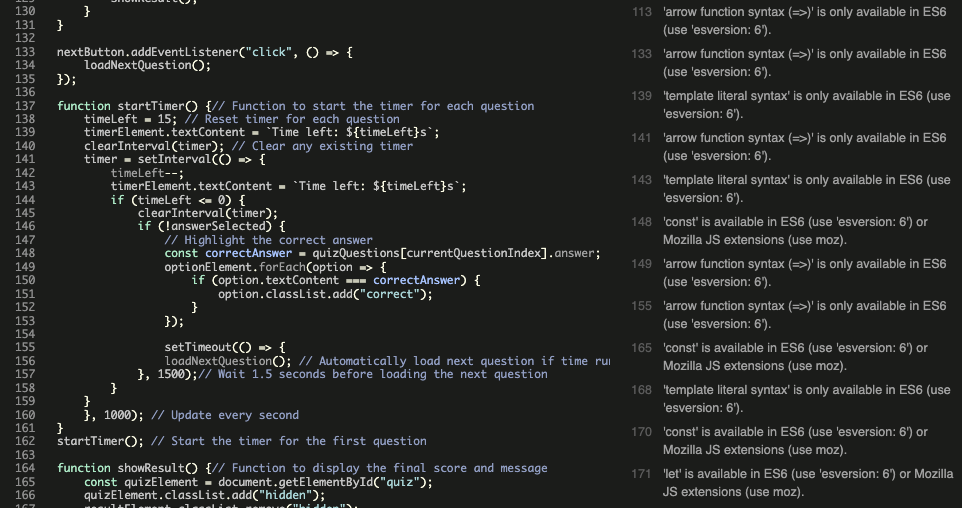
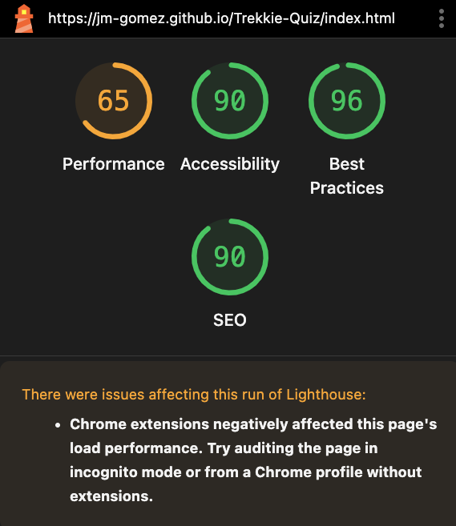
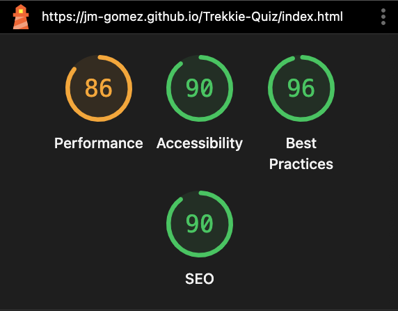

# Star Trek Quiz

## `Description`

My first quiz, created using HTML, CSS and Javascript using VSCode.

The aim was to build a simple quiz with multiple choice questions with a navigation button and feedback at the end based on the score.

The Home page also works as a "How To" page, explaining clearly how to the application works, geting the score at the end and the buttons to either restart the quiz or go back to the Home page. 

Adding a timer proved challenging but i felt it was necessary in order to make the quiz that little bit more fun.
The most challenging part of the application was randomising the questions.

## `Getting Started`
The home screem with the tittle of the quiz at the top, a brief introduction and how to use the quiz.

Start Quiz leads to the next screen:

Question with four options beneath. A next button that becomes active once an option is selected and a countowdn timer on the bottom left.

If the wrong answer is selected, it is highlighted in red and the correct answer is shown in green.

If an asnwer isn't chosen before the timer runs out, the correct asnwer is briefly shown in green before the next question is loaded.

### `Dependencies`
***
* No particular prerequisites required to open this project.
* Open with MacOS, Windows, IOS and Android.

### `Testing`
***

#### *HTML validation*

Application was was run through the official W3C validator and results are as follows:
* Home page

No issues with the Home page.

* Question page

No issues with the Question page.

#### *CSS validation*
The CSS page was run through the W3C CSS validator and returned no errors.

#### *Javascript validation*
Main.js was run through jshint.com and the following errors were revealed, however, they were regarding 'const' and 'let' being available in ES6.

continuation of the validation.

## `Accessibility`
Running a lighthouse report, first time round.

Second time, running it in incognito mode as recommended.

## `Acknowledgments and Sources`

Inspiration and thank you to the following:

[Template](https://gist.github.com/DomPizzie/7a5ff55ffa9081f2de27c315f5018afc) for this Readme.

[Colours](https://htmlcolorcodes.com/) for the colour scheme chosen.

[Basics](https://www.learningpeople.com/uk/) for creating this project.

[W3Schools](https://www.w3schools.com/tags/tag_button.asp) help with creating the buttons.

[Quiz website](https://medium.com/@codepicker57/building-an-interactive-quiz-with-html-css-and-javascript-efe9bd8129e2) help with starting this project.